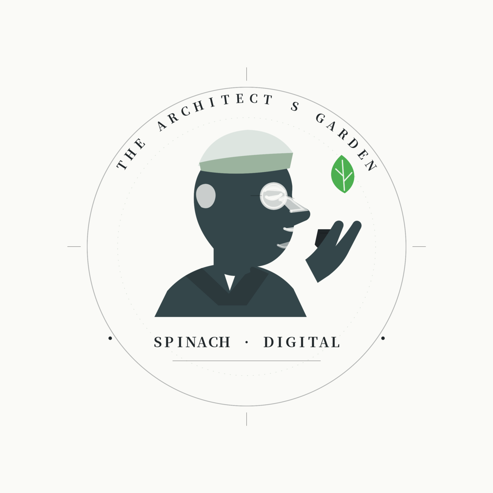
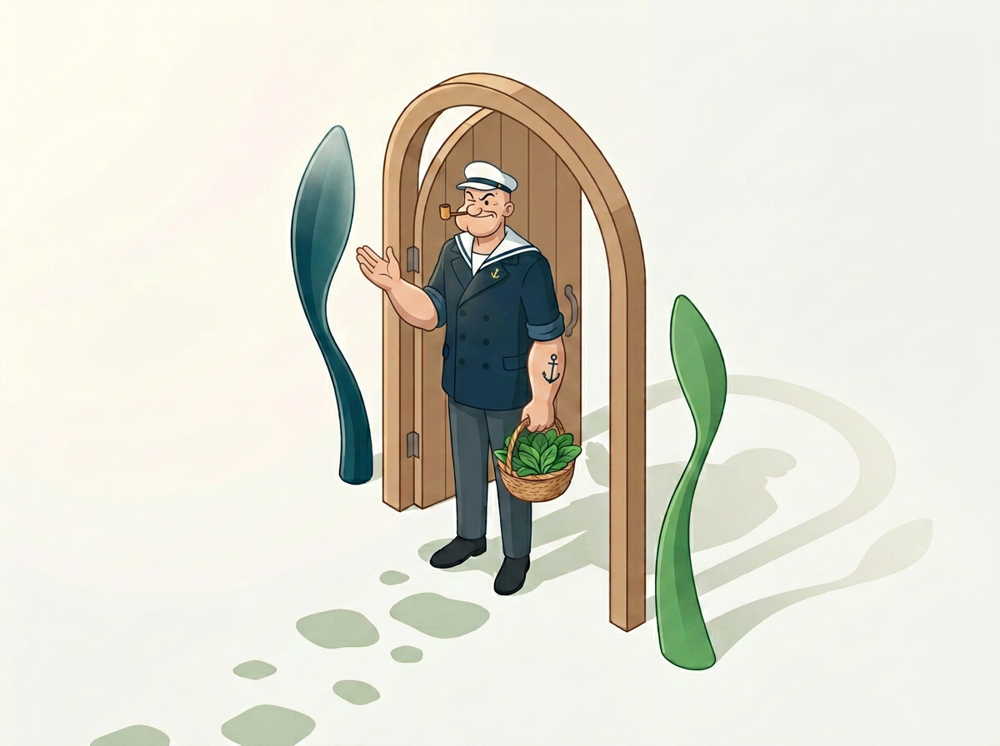

<!-- ════════════════════════════════════════════════════════════════════════════
  GITHUB PROFILE README — ABHISHEK JHA (@SpinachDigital)
  Concept: "THE ARCHITECT'S GARDEN" × Popeye's Strength
  Aesthetic: Fresh agency · Warm off-white · Editorial · Minimal
  Storytelling: Seed → Cultivation → Harvest → Open Gate
  ════════════════════════════════════════════════════════════════════════════ -->

<!-- ━━━━━━━━━━━━━━━━━━━━━━━━━━━━━━━━━━━━━━━━━━━━━━━━━━━━━━━━━━━━━━━━━━━━━━━━━ -->
<!-- ACT I — THE SEED                                                          -->
<!-- "Where Digital Meets Organic."                                            -->
<!-- ━━━━━━━━━━━━━━━━━━━━━━━━━━━━━━━━━━━━━━━━━━━━━━━━━━━━━━━━━━━━━━━━━━━━━━━━━ -->

<!-- The typed instructions from the architect -->

<!-- Email · LinkedIn · GitHub · Instagram -->

---

<!-- ━━━━━━━━━━━━━━━━━━━━━━━━━━━━━━━━━━━━━━━━━━━━━━━━━━━━━━━━━━━━━━━━━━━━━━━━━ -->
<!-- ACT I — THE PHILOSOPHY                                                    -->
<!-- "Code is the spinach."                                                    -->
<!-- ━━━━━━━━━━━━━━━━━━━━━━━━━━━━━━━━━━━━━━━━━━━━━━━━━━━━━━━━━━━━━━━━━━━━━━━━━ -->

<table>
<tr>
<td width="38%" align="center">

<i>the quiet architect</i>

</td>
<td width="62%">

### `the seed`

I'm **Abhishek Jha** — a founder-engineer building **Spinach Digital**, an AI-native company evolving from an agency into a product studio.

Most engineers build machines. I grow systems.

My philosophy is borrowed from a cartoon sailor who taught me something serious: **strength comes from what you put in.** Popeye's spinach wasn't magic — it was fuel, ready when it mattered. For me, **code is the spinach.** The raw catalyst that turns an ordinary founder into a force of nature.

So I keep him around — not as a mascot, but as a quiet **architect**. A sage with a pipe and a basket of greens, building slowly, deliberately, intentionally. He reminds me that the right leverage compounds. The garden grows.

My logo says it quietly: two blades overlapping — one **teal** (the engineering), one **green** (the growth). The intersection is where the magic happens. Where digital meets organic.

</td>
</tr>
</table>

<!-- GitHub doesn't render <iframe> or <html> in README — so we embed the GIF still, and link the live HTML animation below. -->

<i>fuel for strength — the garden grows</i> · <a href="assets/coding-animation.html">▶ view the live 5-second HTML animation</a>

---

<!-- ━━━━━━━━━━━━━━━━━━━━━━━━━━━━━━━━━━━━━━━━━━━━━━━━━━━━━━━━━━━━━━━━━━━━━━━━━ -->
<!-- ACT II — THE INSTRUMENTS                                                  -->
<!-- "The gardener's tools."                                                   -->
<!-- ━━━━━━━━━━━━━━━━━━━━━━━━━━━━━━━━━━━━━━━━━━━━━━━━━━━━━━━━━━━━━━━━━━━━━━━━━ -->

<h3 align="center"><code>the instruments</code></h3>

<i>A tool shed of a master craftsman. Each chosen over years of shipping.</i>

<!-- Languages -->

<!-- Backend / DB / Infra -->

<!-- AI / Cloud / Design -->

 

<table>
<tr>
<td width="25%" align="center"><b>Engineering</b></td>
<td width="25%" align="center"><b>AI Infrastructure</b></td>
<td width="25%" align="center"><b>Product</b></td>
<td width="25%" align="center"><b>Brand</b></td>
</tr>
<tr>
<td align="center" valign="top">

`TypeScript` `Next.js` `React` `Node` `Python`

</td>
<td align="center" valign="top">

`OmniRoute` · 692+ models `Hermes Agent` · autonomous OS `RAG` `LLM chains` `evals`

</td>
<td align="center" valign="top">

`Trip to Yatra` (live) `Spinach Labs` `Supabase` · `Postgres` · `Prisma`

</td>
<td align="center" valign="top">

`Figma` `Tailwind` `shadcn/ui` `Motion` · `GSAP`

</td>
</tr>
</table>

---

<!-- ━━━━━━━━━━━━━━━━━━━━━━━━━━━━━━━━━━━━━━━━━━━━━━━━━━━━━━━━━━━━━━━━━━━━━━━━━ -->
<!-- ACT III — THE HARVEST                                                     -->
<!-- "The yield."                                                              -->
<!-- ━━━━━━━━━━━━━━━━━━━━━━━━━━━━━━━━━━━━━━━━━━━━━━━━━━━━━━━━━━━━━━━━━━━━━━━━━ -->

<h3 align="center"><code>the harvest</code></h3>

<i>Proof that the method works. Products shipped, not screenshots.</i>

<!-- Featured: Trip to Yatra -->
<table>
<tr>
<td width="55%">

### 🌿 Trip to Yatra — AI Marketing OS

A complete agentic marketing platform built on Hermes + OmniRoute for a real travel brand. **17 skills, 4 cron jobs, full brand system.**

- **Stack:** Python · FastAPI · WebSockets · GSAP · anime.js · LLM chains (80-model fallback)
- **Capabilities:** content gen, SEO, competitor monitoring, Meta ads, WhatsApp/Email automation
- **Live:** `localhost:8765` · `triptoyatra.com`

> *"A founder's open-source demonstration that AI agents can replace a marketing department."*

⭐ production-quality · 🛠 solo-built · 📈 compounding

</td>
<td width="45%" align="center">

<!-- Spinach Digital Maker Mark -->

<i>signed by the architect</i>

</td>
</tr>
</table>

 

<!-- Featured: Spinach Labs -->
<table>
<tr>
<td width="100%">

### 🥬 Spinach Labs — AI Infrastructure, Developer Tools, Open Source

An evolving studio shipping developer-grade open source and AI-native products. Currently building OSS around:

`hermes-agent` `omniroute` · `autonomous agents` · `local AI gateways` · `MLOps tooling`

<i>→ infra that gives founders superhuman leverage — the spinach, if you will.</i>

</td>
</tr>
</table>

 

<i>Pinned below — the live repositories from <a href="https://github.com/SpinachDigital?tab=repositories">github.com/SpinachDigital</a>.</i>

---

<!-- ━━━━━━━━━━━━━━━━━━━━━━━━━━━━━━━━━━━━━━━━━━━━━━━━━━━━━━━━━━━━━━━━━━━━━━━━━ -->
<!-- ACT IV — THE SEASONS                                                      -->
<!-- "The calendar of cultivation."                                            -->
<!-- ━━━━━━━━━━━━━━━━━━━━━━━━━━━━━━━━━━━━━━━━━━━━━━━━━━━━━━━━━━━━━━━━━━━━━━━━━ -->

<h3 align="center"><code>the seasons</code></h3>

<i>The record of seasons shipped. Stats framed like a ledger of cultivation.</i>

 

<!-- Spinning icon: 🌱 -->

  
<i>Open source is the harvest shared. Star the repos, fork the ideas, plant your own.</i>

---

<!-- ━━━━━━━━━━━━━━━━━━━━━━━━━━━━━━━━━━━━━━━━━━━━━━━━━━━━━━━━━━━━━━━━━━━━━━━━━ -->
<!-- EPILOGUE — AN OPEN GATE                                                   -->
<!-- "The garden keeps growing."                                               -->
<!-- ━━━━━━━━━━━━━━━━━━━━━━━━━━━━━━━━━━━━━━━━━━━━━━━━━━━━━━━━━━━━━━━━━━━━━━━━━ -->

<h3 align="center"><code>an open gate</code></h3>

<i>The gate at the edge of the garden is open. Walk in.</i>

 

<table>
<tr>
<td width="100%" align="center">

Fellow travelers passing through the field —

  

 &nbsp;
 &nbsp;
 &nbsp;

</td>
</tr>
</table>

 

<!-- Visitor counter — "fellow travelers through the field" -->

<!-- The single green wink — the Popeye strength stamp -->
 
<b><i>fuel for strength. the garden grows.</b></i>
 
 

---

<i>· · ─ ─ ─ ─ ─ ─ ─ ─ ─ ─ ─ ─ ─ ─ ─ ─ ─ ─ ─ ─ ─ ─ ─ · ·</i>
 
<i>Designed with intention · Built in public · Cultivated by Abhishek Jha</i>
 
<i>· · ─ ─ ─ ─ ─ ─ ─ ─ ─ ─ ─ ─ ─ ─ ─ ─ ─ ─ ─ ─ ─ ─ ─ ─ · ·</i>

